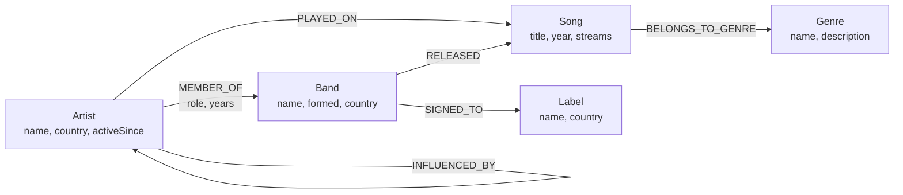
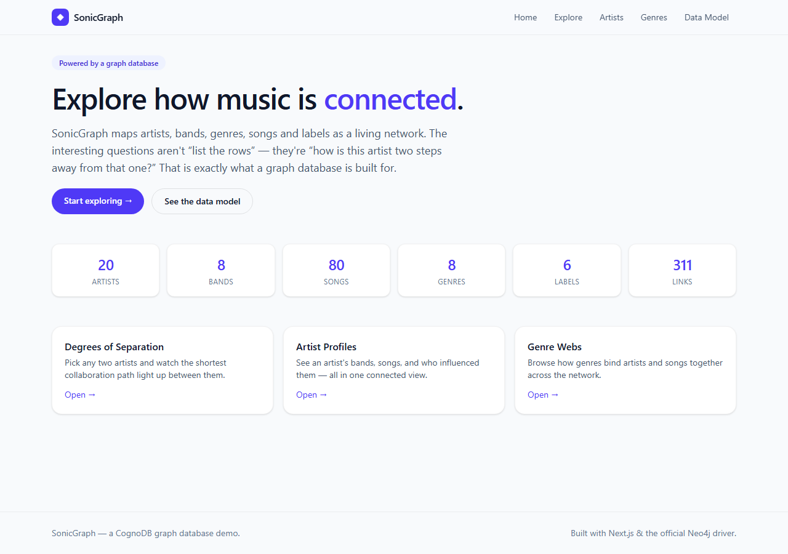
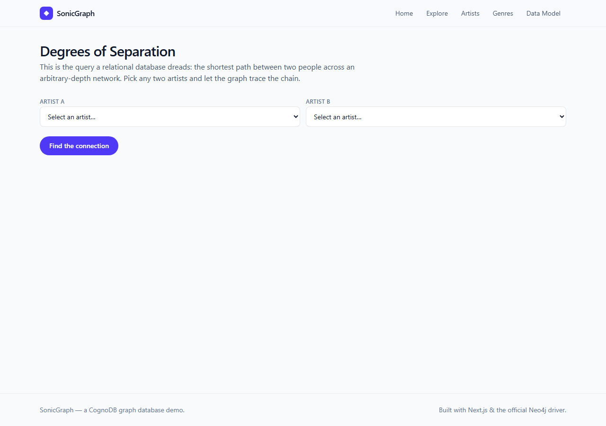

# SonicGraph — A Graph Database Application

**Assignment:** CognoDB Take-Home (Assignment 2) · built with Next.js + the official Neo4j driver against a CognoDB graph database.

SonicGraph is a small, complete web application that explores how musicians,
bands, songs, genres and record labels are **connected**. It is backed by a
labeled-property graph (CognoDB, speaking openCypher over Bolt) and is designed
so a non-technical person can answer relationship questions like *“how is this
artist two steps away from that one?”* without writing a query.

---

## Use case

Music recommendation and discovery is fundamentally about relationships, not
rows. A listener cares about *who collaborated with whom*, *which bands share
members*, and *how an artist's influences ripple through the network*. Those
questions are graph-shaped, and SonicGraph makes them explorable through three
simple screens:

- **Degrees of Separation** — pick any two artists and see the shortest
  collaboration path between them.
- **Artist Profiles** — one connected view of an artist's bands, songs, and
  influences, plus the artists 2–3 hops away through shared bandmates.
- **Genres** — browse how a genre binds its artists and songs together.

The dataset is a realistic, seeded music network (~120 core nodes plus
volume-expanded songs, well within the CognoDB free-tier limits).

---

## Why a graph database?

A relational schema would store `artists`, `bands`, `songs`, `genres` and
`labels` in separate tables joined by foreign keys. That is fine for *“show this
artist's songs”*, but it fights you the moment the question becomes about
**relationships**:

1. **Degrees of separation** — the shortest chain linking two artists — needs
   recursive self-joins of unbounded depth in SQL, or a brittle stored
   procedure. In a graph it is a single `shortestPath()` call.
2. **Multi-hop collaboration webs** — *“artists connected through shared
   bandmates' other projects”* — are natural walks in a graph and explosive,
   slow joins in SQL.
3. The data is inherently connected and uneven: one artist is in three bands,
   another in none. A labeled-property graph models that without empty columns
   or junction-table explosions.

CognoDB (a managed graph database speaking openCypher over the Bolt protocol)
works natively with the official Neo4j drivers, so the app uses the **official
Neo4j JavaScript driver** — no custom database code.

---

## Data model

Labeled nodes, typed relationships, and properties:



- **Nodes:** `Artist`, `Band`, `Song`, `Genre`, `Label`
- **Relationships (typed, some with properties):**
  - `(Artist)-[:MEMBER_OF {role, years}]->(Band)`
  - `(Artist)-[:PLAYED_ON]->(Song)`
  - `(Band)-[:RELEASED]->(Song)`
  - `(Song)-[:BELONGS_TO_GENRE]->(Genre)`
  - `(Artist)-[:INFLUENCED_BY]->(Artist)` *(directed)*
  - `(Band)-[:SIGNED_TO]->(Label)`

---

## Setup & execution

### 1. Provision a free CognoDB instance

1. Sign up for a free **c0** instance at <https://console.cognodb.com/signup>
   (no credit card; provisions in under a minute).
2. Open the instance and copy the connection details:
   - **URI** — `bolt+s://….databases.cognodb.cloud`
   - **Username** — `cognodb`
   - **Password** — shown **only once**; store it securely.
3. Keep the instance running until Wexa AI replies — the app connects to it live.

### 2. Configure environment variables

Copy the template and fill in your values (this file is committed; your
`.env.local` is not):

```bash
cp .env.local.example .env.local
```

```bash
# .env.local
COGNODB_URI=bolt+s://xxxx.databases.cognodb.cloud
COGNODB_USER=cognodb
COGNODB_PASSWORD=your-password-shown-once
```

> Credentials are read **strictly from environment variables** and are never
> hardcoded or committed. `.env*` is git-ignored.

### 3. Install & seed

```bash
pnpm install
pnpm seed      # loads the music graph into CognoDB (idempotent: uses MERGE)
```

### 4. Run locally

```bash
pnpm dev       # http://localhost:3000
```

If the database is unreachable or unconfigured, every page renders a clear,
actionable error state instead of crashing.

---

## Main queries

All Cypher is **parameterized** through the official Neo4j driver — user input
is passed via the `$param` map and is never concatenated into the query string.
The full set lives in [`lib/queries.ts`](lib/queries.ts).

| Query | What it shows | Why it matters |
| --- | --- | --- |
| `stats` | Counts of each node label and total relationships | Graph shape at a glance |
| `searchArtists` | Artists whose name starts with a term | Powers the search box |
| `artistProfile` | An artist's bands, songs, and influences | One connected 1-hop view |
| `collaborationWeb` | **Multi-hop (3 hops):** artists linked through shared bandmates' other projects | Awkward in SQL, trivial as a graph walk |
| `degreesOfSeparation` | **`shortestPath`** between two artists across the whole graph | The canonical graph-native query SQL cannot express directly |
| `genreExplorer` / `listGenres` | Artists & songs attached to a genre | Shows how genres tie the graph together |

Example of the relational-awkward query (parameterized):

```cypher
MATCH p = shortestPath(
  (from:Artist {name: $from})-[*]-(to:Artist {name: $to})
)
RETURN [n IN nodes(p) |
  { label: head(labels(n)), name: coalesce(n.name, n.title, head(labels(n))) }
] AS path,
length(p) AS degrees
```

---

## Project structure

```
app/
  page.tsx              # Home: use case + live graph stats
  explore/page.tsx      # Degrees of separation (calls /api/degree)
  artists/page.tsx      # Searchable artist list
  artists/[id]/page.tsx # Artist profile + collaboration web
  genres/page.tsx       # Genre browser
  model/page.tsx        # Data model, why-graph, query reference
  api/degree/route.ts   # Route handler (graceful JSON errors)
components/             # Reusable UI + state components
lib/neo4j.ts            # Env-driven driver + graceful error types
lib/queries.ts          # Single source of truth for all Cypher
lib/types.ts            # Domain types
scripts/seed.ts         # Parameterized, idempotent seed script
```

---

## Deploy (hosted demo)

1. Push this repo to GitHub.
2. Import it into [Vercel](https://vercel.com/new).
3. Add the three `COGNODB_*` environment variables in the project settings.
4. Deploy — the app renders dynamically and connects to your live CognoDB
   instance.

---

## Screenshots & demo video

| Screen | File |
| --- | --- |
| Home / graph stats | `docs/screenshots/home.png` |
| Degrees of separation | `docs/screenshots/explore.png` |
| Artist list (search) | `docs/screenshots/artists.png` |
| Artist profile + collaboration web | `docs/screenshots/profile.png` |
| Genre browser | `docs/screenshots/genres.png` |
| Data model & queries | `docs/screenshots/model.png` |




> Capture a screen recording (≤2 minutes) walking through: provisioning → seeding
> → exploring the graph. Attach it to the submission email.

---

## Submission checklist

- [ ] GitHub repo URL shared
- [ ] `.env.local` populated (not committed)
- [ ] `pnpm seed` run against the live CognoDB instance
- [ ] Hosted demo link (Vercel) working
- [ ] Short screen recording attached
- [ ] Email to **hr@wexa.ai** with subject `CognoDB Assignment 2 – <your name>`
- [ ] CognoDB instance left running until you hear back
